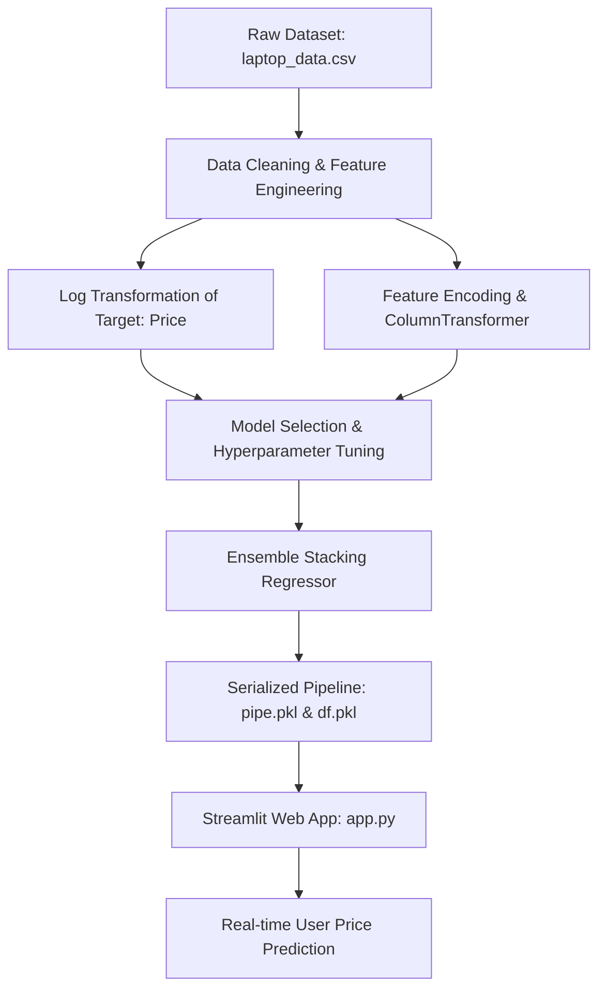

# 💻 Laptop Price Predictor — End-to-End Machine Learning System

A complete Machine Learning and Web Application project that predicts laptop market prices based on hardware specifications, display quality, brand, and operating system.

---

## 📌 Table of Contents
1. [Project Overview](#-project-overview)
2. [Architecture & Workflow](#-architecture--workflow)
3. [Dataset & Features](#-dataset--features)
4. [Data Preprocessing & Feature Engineering](#-data-preprocessing--feature-engineering)
5. [Model Training & Evaluation](#-model-training--evaluation)
6. [Web Application (Streamlit)](#-web-application-streamlit)
7. [Project Structure](#-project-structure)
8. [Installation & Setup](#-installation--setup)
9. [How to Run the Application](#-how-to-run-the-application)
10. [Key Takeaways & Future Enhancements](#-key-takeaways--future-enhancements)

---

## 📖 Project Overview

When purchasing or selling laptops, pricing varies significantly based on configuration nuances (CPU series, GPU tier, storage type combinations, display resolution, and form factor). 

This project solves this by:
- Processing raw laptop technical specifications and engineering predictive features (like display pixel density / PPI).
- Training and evaluating diverse Machine Learning regression algorithms (Linear, Tree-based, Ensemble, and Stacking).
- Deploying the best-performing model as an interactive **Streamlit web application** that provides real-time price estimations in Indian Rupees (₹).

---

## 🏗 Architecture & Workflow



---

## 📊 Dataset & Features

The dataset (`laptop_data.csv`) contains specifications for over 1,300 laptop configurations across global brands.

| Feature Name | Description | Type / Example |
| :--- | :--- | :--- |
| `Company` | Laptop manufacturer | Apple, Dell, HP, Lenovo, Asus, Acer, etc. |
| `TypeName` | Category / Form factor | Ultrabook, Notebook, Gaming, 2 in 1 Convertible, Workstation, Netbook |
| `Ram` | System Memory | 2 GB, 4 GB, 8 GB, 16 GB, 32 GB, 64 GB |
| `Weight` | Physical weight of laptop | Float (in kg) |
| `Touchscreen` | Touch-enabled display | Binary (0 = No, 1 = Yes) |
| `Ips` | IPS panel for wide viewing angles | Binary (0 = No, 1 = Yes) |
| `ppi` | Pixels Per Inch (Screen density) | Float calculated from resolution & screen size |
| `Cpu brand` | Categorized processor brand | Intel Core i3, Intel Core i5, Intel Core i7, Other Intel, AMD |
| `HDD` | Traditional Hard Disk storage | 0, 128, 256, 512, 1024, 2048 GB |
| `SSD` | Solid State Drive storage | 0, 8, 128, 256, 512, 1024 GB |
| `Gpu brand` | Dedicated/Integrated graphics manufacturer | Intel, Nvidia, AMD |
| `os` | Operating system category | Windows, Mac, Others/Linux/No OS |
| `Price` *(Target)* | Market price (in INR ₹) | Continuous numerical value |

---

## ⚙️ Data Preprocessing & Feature Engineering

1. **Target Normalization**:
   - The raw `Price` feature exhibited right-skewness. A logarithmic transformation (`np.log(Price)`) was applied to stabilize variance and normalize target distributions for linear/regression estimators. Predictions are converted back using `np.exp()`.

2. **Display & Resolution Engineering (PPI)**:
   - Extracted horizontal ($X_{res}$) and vertical ($Y_{res}$) pixel counts from `ScreenResolution`.
   - Extracted flags for `Touchscreen` and `IPS` panel technology.
   - Computed Pixels Per Inch:
     $$\text{PPI} = \frac{\sqrt{X_{\text{res}}^2 + Y_{\text{res}}^2}}{\text{Screen Size (Inches)}}$$

3. **CPU Classification**:
   - Parsed processor strings to isolate Intel tiers (`Intel Core i3`, `i5`, `i7`), AMD processors, and legacy/entry-level Intel variants (`Celeron`, `Pentium` grouped as `Other Intel Processor`).

4. **Storage Disaggregation**:
   - Decomposed composite `Memory` strings (e.g., `"128GB SSD + 1TB HDD"`) into explicit numerical columns: `SSD` and `HDD` (in GB).
   - Eliminated obsolete `Flash Storage` and `Hybrid` fields due to negligible sample representation and weak correlation.

5. **GPU & OS Grouping**:
   - Extracted primary vendor (`Intel`, `AMD`, `Nvidia`). Filtered rare single instances (`ARM`).
   - Mapped disparate OS distributions into 3 streamlined classes: `Windows`, `Mac`, and `Others/No OS/Linux`.

---

## 🤖 Model Training & Evaluation

The notebook (`laptop-price-predictor.ipynb`) evaluated several machine learning models wrapped in Scikit-Learn `Pipeline` and `ColumnTransformer` pipelines with `OneHotEncoder` on categorical features.

### Algorithms Tested:
1. **Linear Models**: Linear Regression, Ridge, Lasso
2. **Instance & Tree Models**: K-Nearest Neighbors (KNN), Decision Trees, Support Vector Regressor (SVR)
3. **Ensemble & Boosting**:
   - Random Forest Regressor
   - Extra Trees Regressor
   - AdaBoost Regressor
   - Gradient Boosting Regressor
   - XGBoost Regressor
   - Voting Regressor
4. **Stacked Generalization (Stacking Regressor)** ⭐ *(Selected Model)*

### Best Model Architecture:
- **Base Estimators**:
  - `RandomForestRegressor` ($n\_estimators=350, max\_depth=15, max\_features=0.75, max\_samples=0.5$)
  - `GradientBoostingRegressor` ($n\_estimators=100, max\_features=0.5$)
  - `XGBRegressor` ($n\_estimators=25, max\_depth=5, learning\_rate=0.3$)
- **Final Estimator (Meta-Learner)**: `Ridge(alpha=100)`
- **Evaluation Metrics**:
  - **$R^2$ Score**: ~0.88 (Explains ~88% of price variance)
  - **MAE (Log Scale)**: ~0.167

---

## 🖥 Web Application (Streamlit)

The web UI is implemented in `app.py` using Streamlit.

### User Flow:
1. User selects laptop brand, form-factor, RAM, Weight, Display features, CPU, Storage, GPU, and OS.
2. The application dynamically derives screen `PPI` based on chosen resolution and screen size slider.
3. Constructs input vector matching the Scikit-Learn pipeline signature.
4. Feeds input into `pipe.pkl` and outputs the exponential forecast as a formatted price in **₹ (INR)**.

---

## 📁 Project Structure

```text
laptop-price-prediction/
├── app.py                         # Streamlit interactive web application
├── laptop-price-predictor.ipynb   # Jupyter Notebook with EDA, preprocessing & model training
├── laptop_data.csv                # Raw dataset
├── pipe.pkl                       # Serialized trained Scikit-Learn pipeline
├── df.pkl                         # Cleaned reference dataframe metadata
├── requirements.txt               # Project dependencies
└── README.md                      # Project documentation
```

---

## 🚀 Installation & Setup

### Prerequisites
- Python 3.9+ (Python 3.10 / 3.11 recommended)
- Virtual environment tool (`venv` or `conda`)

### 1. Clone the repository
```bash
git clone <repository-url>
cd laptop-price-prediction
```

### 2. Create and activate a virtual environment
```bash
# On macOS / Linux:
python3 -m venv venv
source venv/bin/activate

# On Windows:
python -m venv venv
venv\Scripts\activate
```

### 3. Install required packages
```bash
pip install -r requirements.txt
```

---

## 💻 How to Run the Application

Launch the Streamlit app with:

```bash
streamlit run app.py
```

Once started, open your browser and navigate to `http://localhost:8501`.

---

## 🎯 Key Takeaways & Future Enhancements

- **Domain-Specific Feature Engineering**: Creating `PPI` and isolating `SSD`/`HDD` capacities significantly improved model accuracy over raw categorical inputs.
- **Log Target Transformation**: Greatly reduced residual error for premium and gaming laptop price spikes.
- **Future Improvements**:
  - Add real-time price scraping to update price changes over time.
  - Include GPU generation series (e.g., RTX 3060 vs RTX 4080) for finer-grained gaming laptop valuations.
  - Containerize deployment with Docker / cloud hosting (Streamlit Community Cloud, Hugging Face Spaces, or AWS EC2).
